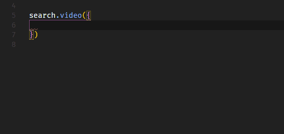

# Installation

```bash
npm install niconico-search-api
```

# Usage

```js
import search from 'niconico-search-api'

search
  .video({
    q: '東方アレンジ',
    targets: ['tagsExact'],
    fields: ['title', 'viewCounter', 'contentId'],
    sort: '-viewCounter',
    limit: 20,
  })
  .then((videos) => console.log(videos))
```

# Methods

- video (params: [SearchParams](#searchparams))

- live (params: [SearchParams](#searchparams))

### SearchParams

| params      | Type     |
| ----------- | -------- |
| q           | string   |
| targets     | string[] |
| fields?     | string[] |
| jsonFilter? | object   |
| sort        | string   |
| offset?     | number   |
| limit?      | number   |
| context?    | string   |

Return: Promise\<ResponseData\>

# License

[MIT](LICENSE)
